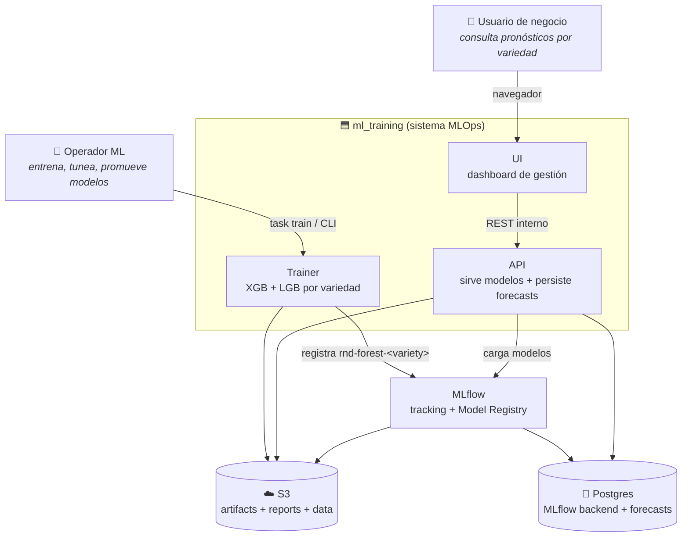
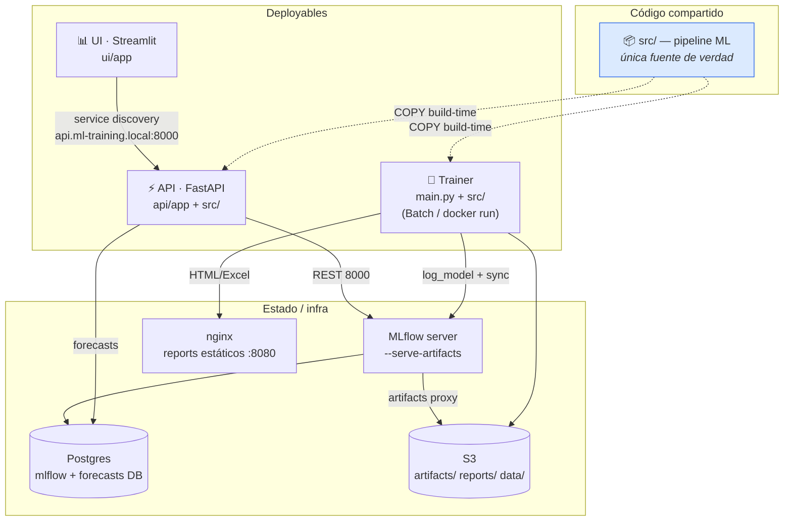
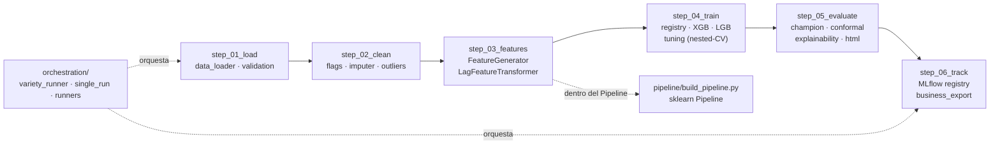
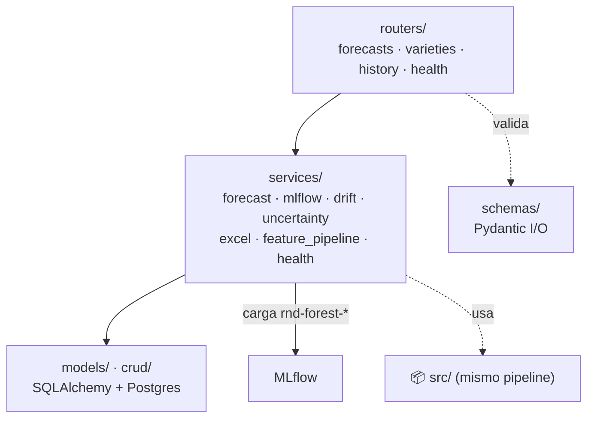
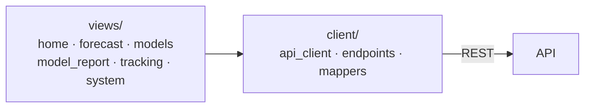
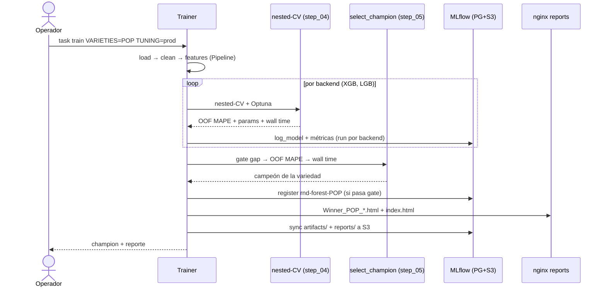
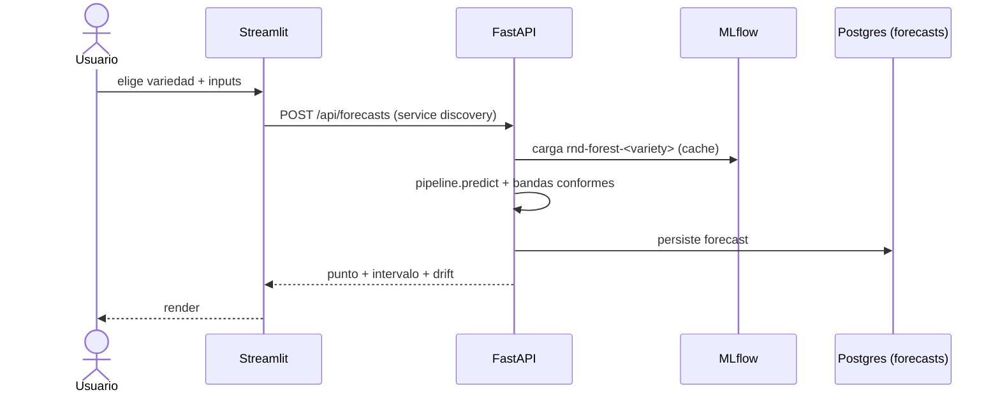
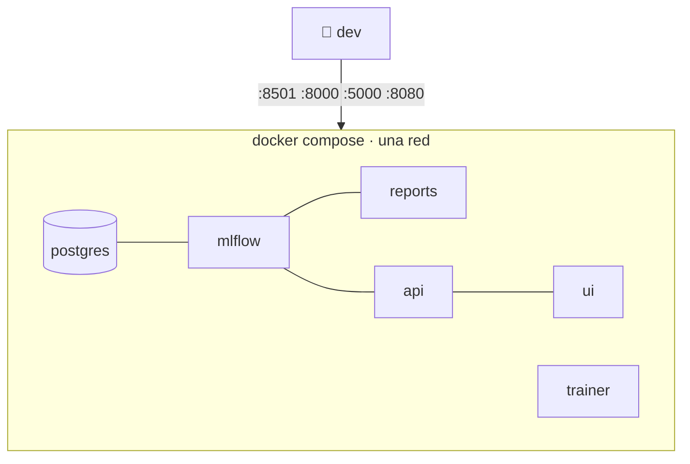
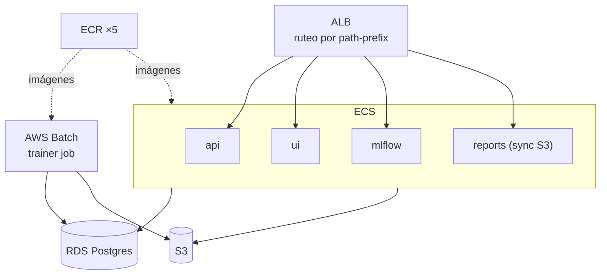

# Arquitectura — ml_training

Vista **visual** (C4 + secuencia + despliegue) del sistema end-to-end. Es la capa
de diagramas que complementa, sin duplicar, las fuentes autoritativas:

- **`README.md`** — diseño ML a fondo: features, champion, nested-CV, anti-overfitting,
  convenciones MLflow (`#197 Mapa de la arquitectura`, `#264 Flujo del pipeline`).
- **`GUIA_MLOPS_AWS_V2.md`** — runbook local + AWS y los **ADR-001..004**.
- **`CLAUDE.md`** — invariantes no-obvios (leer antes de tocar código).

> Los diagramas son Mermaid: GitHub los renderiza nativo. En local, cualquier
> previsualizador de Markdown con Mermaid (VS Code + extensión) los muestra.

---

## 1. Contexto del sistema (C4 · nivel 1)

Qué problema resuelve y con quién/qué habla. El sistema pronostica
**`KG/JR_H`** (kg por jornal-hora) por **variedad** de cultivo.

**Frontera clave:** el sistema **decide** el modelo campeón (ADR-002); no hay flag
para forzar un backend. El contrato entre piezas es el prefijo de registro
`rnd-forest-<variety>` (invariante #8 en `CLAUDE.md`).

---

## 2. Contenedores (C4 · nivel 2)

Tres deployables comparten **una sola** base de código ML (`src/`). Esto es
deliberado: el `api/Dockerfile` tiene como build-context la raíz del repo
para `COPY src/` — trainer y API cargan el **mismo** pipeline (invariante #1).

| Contenedor | Puerto local | Rol | Doc |
|---|---|---|---|
| Trainer | — (job) | entrena XGB+LGB, elige champion, registra | README #264 |
| API (FastAPI) | `:8000/docs` | sirve modelos + persiste forecasts a Postgres | — |
| UI (Streamlit) | `:8501` | dashboard de gestión | — |
| MLflow | `:5000` | tracking + registry (backend **siempre** PG+S3, ADR-001/003) | GUIA ADR-001 |
| Postgres | interno | DB de MLflow **+** DB `forecasts` (separadas, invariante #7) | — |
| nginx reports | `:8080` | HTML/Excel estáticos del dashboard | — |

> **Ruteo en prod:** la API se enruta por prefijos específicos
> (`/api/health*`, `/api/forecasts*`, …), **nunca** `/api/*` genérico — MLflow
> con `--serve-artifacts` es dueño de `/api/2.0/mlflow-artifacts/*` (invariante #6).

---

## 3. Componentes (C4 · nivel 3)

### 3.1 Trainer — pipeline por pasos (`src/`)

Los paquetes `step_XX_verbo/` **codifican el orden del pipeline** y sus nombres
están horneados en los `.joblib` serializados → **no se renombran** (invariante #4).

**Invariante #9 (anti-leakage):** los lags se computan **dentro** del
`sklearn.Pipeline` (`LagFeatureTransformer`, paso 0), no en el loader — así cada
fold de CV calcula lags solo desde su propio slice de train.

### 3.2 API — capas (`api/app/`)

### 3.3 UI — capas (`ui/app/`)

`views/` son las páginas reales (registradas vía `st.navigation`); **no** hay
`pages/`. El `client/` espeja la superficie de la API (mantener en sync, inv. #10).

---

## 4. Secuencia — un entrenamiento end-to-end

> `--tuning smoke` **nunca** registra modelos (invariante #2). El gate de champion
> es lex-order estricto: `|gap|` (constraint) → OOF business MAPE → wall time.

## 5. Secuencia — servir un pronóstico

---

## 6. Despliegue

### Local (docker compose)

`postgres + mlflow + reports + api + ui` levantan como bloque; el trainer corre
on-demand. URLs: UI `:8501`, API `:8000/docs`, MLflow `:5000`, reports `:8080`.
**No hay `:80` local** (eso es el ALB de prod).

### AWS (Terraform · `infra/modules/`)

Módulos Terraform: `network · storage · mlflow · api · ui · reports · batch ·
scheduler · lambdas · monitoring · cicd · _shared`. CI/CD (GHA OIDC → ECR/ECS)
en `GUIA_MLOPS_AWS_V2.md #3.10`. `task wake/sleep` apaga/enciende el bloque
(RDS+MLflow+reports+api+ui) como modelo de costo.

---

## 7. Invariantes que la arquitectura DEBE preservar

Resumen accionable; el detalle vive en `CLAUDE.md` (#1–#10).

| # | Invariante | Por qué |
|---|---|---|
| 1 | `src/` única fuente de verdad; API la `COPY`a (no vendoring) | trainer y API comparten pipeline; vendoring → drift silencioso |
| 4 | No renombrar `step_XX_verbo/` | paths horneados en `.joblib` serializados |
| 8 | Prefijo `rnd-forest-<variety>` es contrato trainer↔API | la API carga por ese nombre |
| 9 | Lags **dentro** del Pipeline | evita leakage entre folds de CV |
| 1/3 | MLflow backend **siempre** PG+S3 | nunca `file://mlruns`, sqlite, LocalStack |

---

*Para profundidad de cada decisión: `README.md` (#305 Decisiones técnicas con
respaldo estadístico) y los ADR en `GUIA_MLOPS_AWS_V2.md`.*
