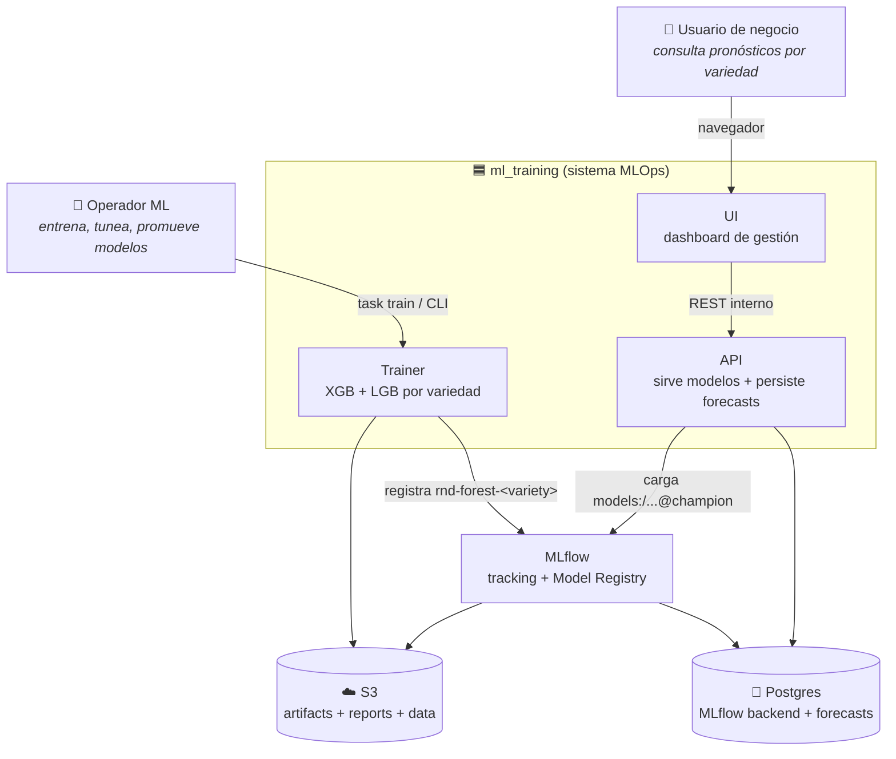
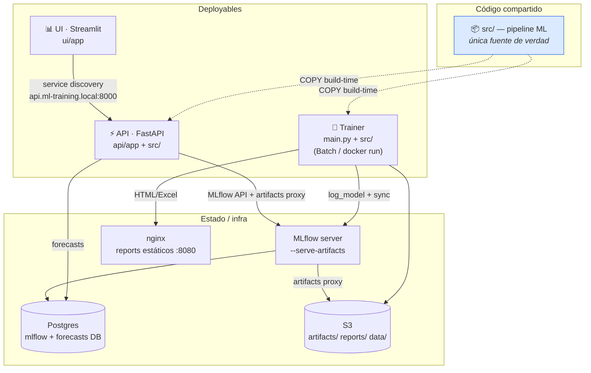
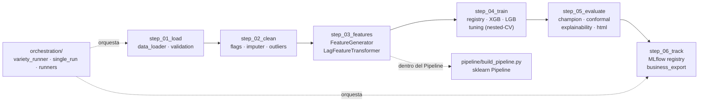
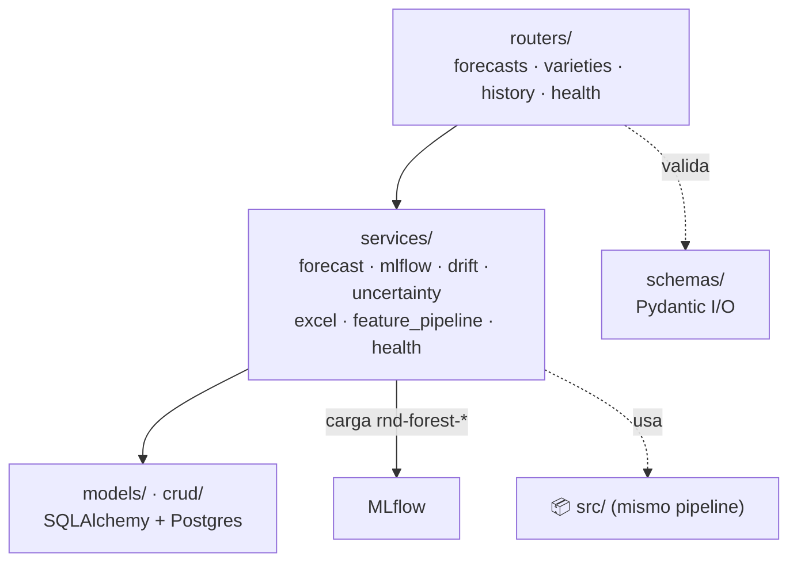
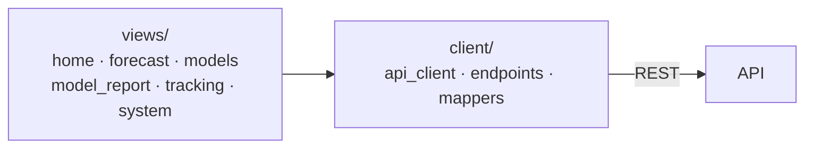
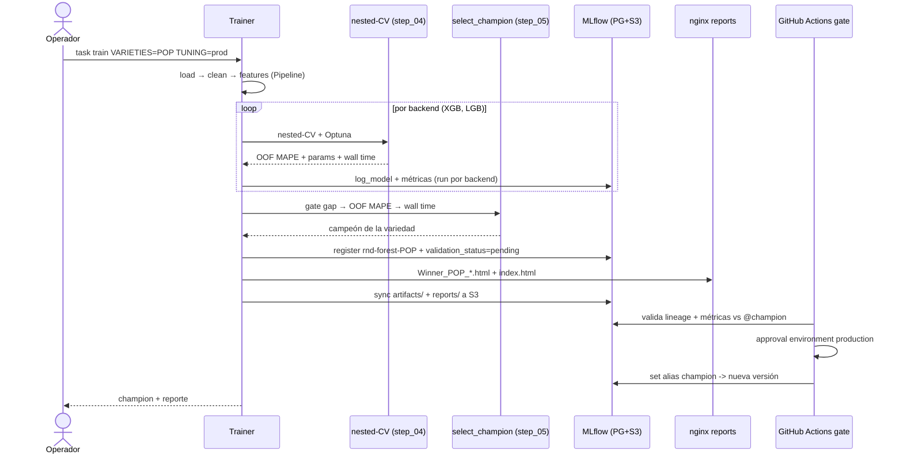
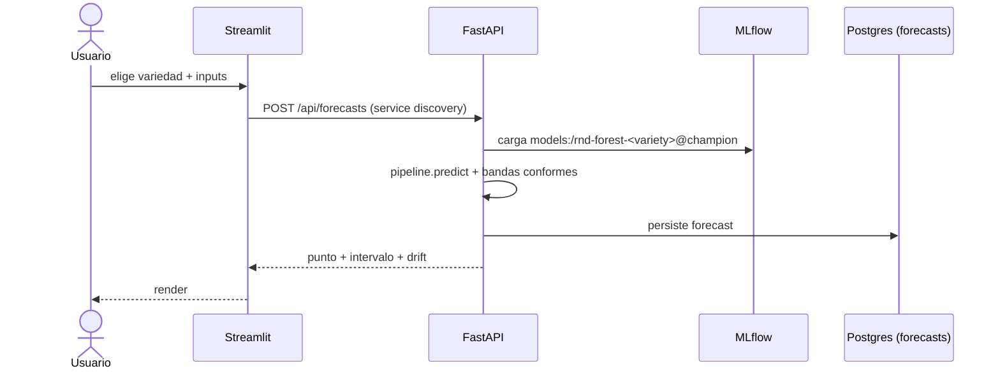
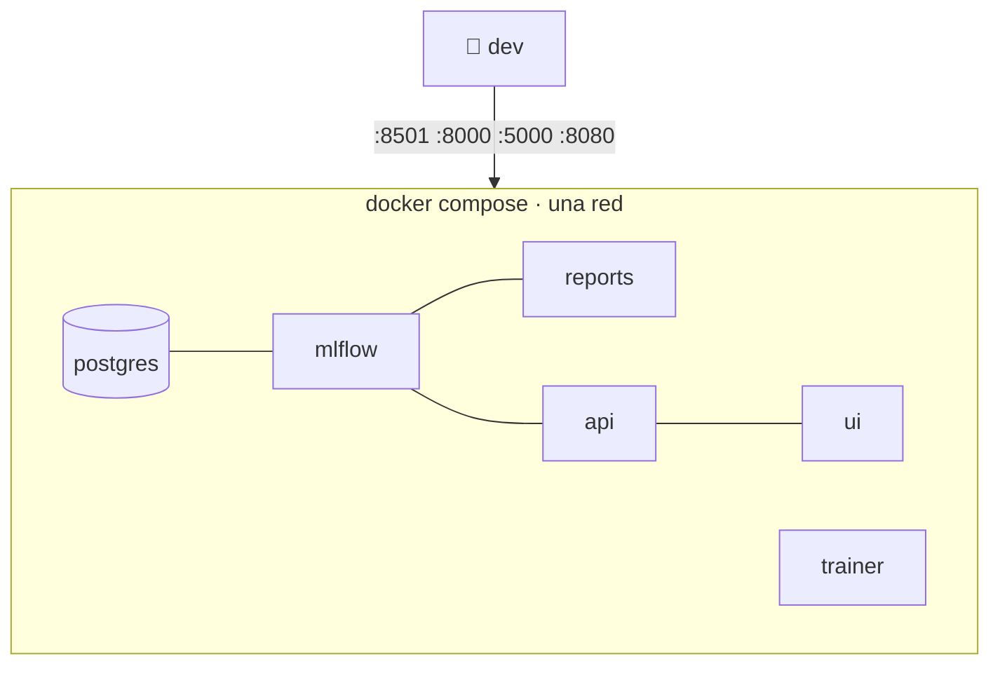
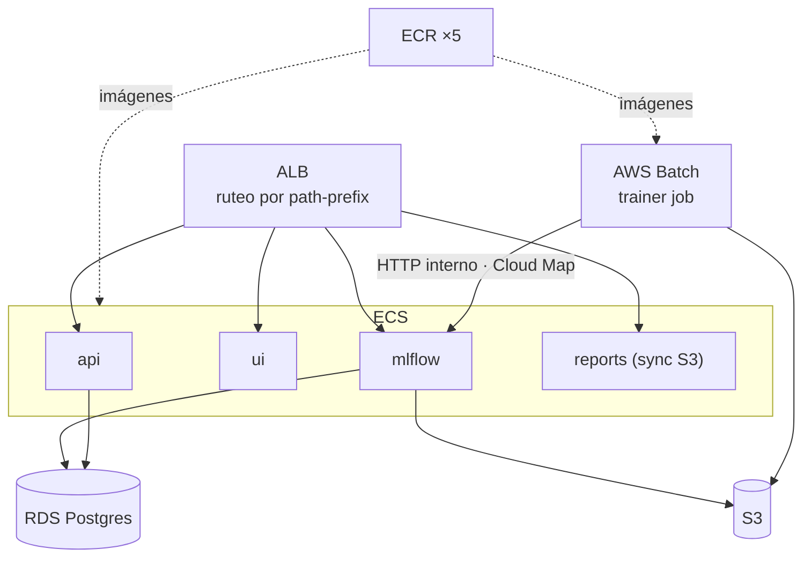
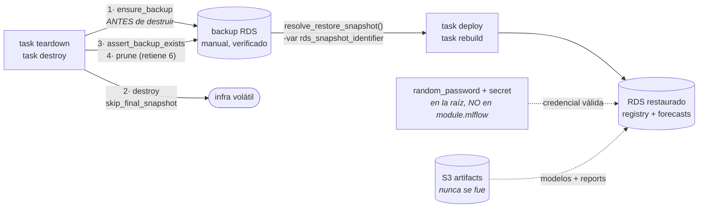

# Arquitectura — ml_training

Vista **visual** (C4 + secuencia + despliegue) del sistema end-to-end. Es la capa
de diagramas que complementa, sin duplicar, las fuentes autoritativas:

- **`../README.md`** — diseño ML a fondo: features, champion, nested-CV, anti-overfitting,
  convenciones MLflow (`#197 Mapa de la arquitectura`, `#264 Flujo del pipeline`).
- **[`01-local.md`](01-local.md)** y **[`02-produccion-aws.md`](02-produccion-aws.md)** — los runbooks local y AWS.
- **[`adr/`](adr/)** — las decisiones ratificadas (ADR-001..009), con su contexto y sus consecuencias.
- **`../CLAUDE.md`** — invariantes no-obvios (leer antes de tocar código).

> Los diagramas son Mermaid: GitHub los renderiza nativo. En local, cualquier
> previsualizador de Markdown con Mermaid (VS Code + extensión) los muestra.

> [!IMPORTANT]
> La topología se mantiene: AWS Batch entrena; ECS Fargate sirve MLflow, API,
> UI y reports; RDS guarda metadata; S3 guarda datos y artifacts. El perfil
> económico con ALB público por HTTP se considera laboratorio. Para producción
> expuesta son obligatorios HTTPS, autenticación, pruebas y los controles de la
> Parte 10 de [`02-produccion-aws.md`](02-produccion-aws.md).

---

## 1. Contexto del sistema (C4 · nivel 1)

Qué problema resuelve y con quién/qué habla. El sistema pronostica
**`KG/JR_H`** (kg por jornal-hora) por **variedad** de cultivo.

**Frontera clave:** el sistema **decide** el modelo campeón (ADR-002); no hay flag
para forzar un backend. El contrato entre piezas es el prefijo de registro
`rnd-forest-<variety>` (invariante #8 en `CLAUDE.md`).

---

## 2. Contenedores (C4 · nivel 2)

Tres deployables comparten **una sola** base de código ML (`src/`). Esto es
deliberado: el `api/Dockerfile` tiene como build-context la raíz del repo
para `COPY src/` — trainer y API cargan el **mismo** pipeline (invariante #1).

| Contenedor | Puerto local | Rol | Doc |
|---|---|---|---|
| Trainer | — (job) | entrena XGB+LGB, elige champion, registra | README #264 |
| API (FastAPI) | `:8000/docs` | sirve modelos + persiste forecasts a Postgres | — |
| UI (Streamlit) | `:8501` | dashboard de gestión | — |
| MLflow | `:5000` | tracking + registry (backend **siempre** PG+S3, ADR-001/003) | [ADR-001](adr/ADR-001-mlflow-backend-postgres-s3.md) |
| Postgres | interno | DB de MLflow **+** DB `forecasts` (separadas, invariante #7) | — |
| nginx reports | `:8080` | HTML/Excel estáticos del dashboard | — |

> **Ruteo en prod:** la API se enruta por prefijos específicos
> (`/api/health*`, `/api/forecasts*`, …), **nunca** `/api/*` genérico — MLflow
> con `--serve-artifacts` es dueño de `/api/2.0/mlflow-artifacts/*` (invariante #6).

---

## 3. Componentes (C4 · nivel 3)

### 3.1 Trainer — pipeline por pasos (`src/`)

Los paquetes `step_XX_verbo/` **codifican el orden del pipeline** y sus nombres
están horneados en los `.joblib` serializados → **no se renombran** (invariante #4).

**Invariante #9 (anti-leakage):** los lags se computan **dentro** del
`sklearn.Pipeline` (`LagFeatureTransformer`, paso 0), no en el loader — así cada
fold de CV calcula lags solo desde su propio slice de train.

### 3.2 API — capas (`api/app/`)

### 3.3 UI — capas (`ui/app/`)

`views/` son las páginas reales (registradas vía `st.navigation`); **no** hay
`pages/`. El `client/` espeja la superficie de la API (mantener en sync, inv. #10).

---

## 4. Secuencia — un entrenamiento end-to-end

> `--tuning smoke` **nunca** registra modelos (invariante #2). El gate de champion
> es lex-order estricto: `gap_rel=|gap|/MAE_test` (constraint) →
> OOF business MAPE → wall time. Para promoción de forecast puede añadirse el
> gate temporal opt-in descrito en
> [`04-guia-validacion-estadistica.md`](04-guia-validacion-estadistica.md).

## 5. Secuencia — servir un pronóstico

---

## 6. Despliegue

### Local (docker compose)

`postgres + mlflow + reports + api + ui` levantan como bloque; el trainer corre
on-demand. URLs: UI `:8501`, API `:8000/docs`, MLflow `:5000`, reports `:8080`.
**No hay `:80` local** (eso es el ALB de prod).

### AWS (Terraform · `infra/modules/`)

**Fronteras de red**

- ALB es la única entrada. En producción escucha HTTPS y autentica; 80 solo
  redirige.
- ECS, Batch y RDS viven en subnets privadas y no reciben IP pública.
- API y Batch llaman a MLflow por Cloud Map; no hacen hairpin por el ALB.
- Solo MLflow y API llegan a RDS, cada uno con usuario de base separado.
- El artifact store de MLflow se consume por proxy. `/artifacts/*` no se
  publica como directorio navegable.

Módulos Terraform: `network · storage · mlflow · api · ui · reports · batch ·
scheduler · lambdas · monitoring · cicd · _shared`. El módulo **`cicd` es
opcional**: `enable_cicd=false` (default) levanta todo el stack **sin** depender
del bootstrap OIDC (`task infra:bootstrap-oidc`); se activa después con
`enable_cicd=true`. Detalle CI/CD en `[`02-produccion-aws.md` #3.11](02-produccion-aws.md#parte-3--modulos-terraform)`.

**Modelo de costo (sin cambiar la topología).** El stack opera **miércoles y
jueves, 08:00-16:00 PET** (`workdays_cron = "WED,THU"`) y se destruye entre
ventanas. Los importes de `02-produccion-aws.md` son una estimación fechada y
deben recalcularse con Pricing Calculator + Cost Explorer. Las palancas, en
orden de impacto:
- **`task teardown` / `task rebuild`** — **el ciclo semanal**: `teardown` el
  jueves destruye los módulos volátiles (**el RDS incluido**, respaldándolo
  antes) y libera ALB + NAT preservando VPC/storage; `rebuild` el miércoles los
  recrea **restaurando el RDS del backup**. Piso ~$1/mes mientras tanto. Acá
  está el 90% del ahorro: ALB + NAT facturan mientras **existan**, aunque el
  scheduler haya apagado todo lo demás.
- **Scheduler (start/stop)** — dentro de esos dos días apaga Fargate + RDS fuera
  de la ventana. Solo alcanza la noche del miércoles: ~$5/mes.
- **`task wake/sleep`** — para pausas cortas de 1-2 noches, **no para el ciclo
  semanal** (la pausa jueves→miércoles roza el auto-arranque del RDS a los 7
  días). Libera ALB+NAT por default → piso ~$4/mes; con `RELEASE_NET=false`
  mantiene la red para wake instantáneo → piso ~$50/mes.
- **Fargate Spot** en `reports` + `ui` (stateless, ~70% más baratos); MLflow y
  API quedan on-demand a propósito (MLflow es crítico durante runs largos).
- **RDS** `db.t4g.small` (no `micro`): hostea MLflow + `forecasts`, con
  `deletion_protection` por default (las tareas de teardown lo levantan vía AWS
  CLI para permitir el destroy, tras haber respaldado).

**Ciclo backup → restauración.** `sleep` *para* el RDS; `teardown` lo
**destruye**. Como MLflow tracking/registry y la tabla `forecasts` viven en esa
instancia (invariante #7), su estado sobrevive únicamente vía **backup** (un
snapshot manual de RDS — no un objeto de S3):

Cuatro piezas hacen que esto no se rompa:
- **El backup se toma ANTES del destroy**, no como `final_snapshot` de Terraform
  (que se materializa *durante* el destroy). Si el destroy falla a la mitad —el
  caso real es el RDS en `stopped` → `InvalidDBInstanceState`— con el orden
  viejo quedabas sin infra y sin backup. `ensure_rds_available`
  (`tasks/lib/nuke.sh`) re-arranca la instancia para poder respaldarla.
- **`deploy` y `rebuild` restauran con la misma función**
  (`resolve_restore_snapshot`). Antes sólo `rebuild` lo hacía, y un `deploy`
  posterior a un destroy levantaba un RDS vacío en silencio.
- La **credencial master vive en la raíz** (`infra/envs/prod/rds_secret.tf`), no
  en `module.mlflow`. Si viviera dentro, el teardown la destruiría y el rebuild
  generaría una password nueva incompatible con la del backup restaurado.
- `snapshot_identifier` lleva **`ignore_changes`** obligatorio: es `ForceNew`, y
  sin él cualquier apply posterior que no repita el `-var` recrearía el RDS.

Los artifacts de MLflow (modelos, reports) viven en S3 y **no participan de este
ciclo**: `teardown` no toca `module.storage`, así que siguen ahí sin necesidad de
restaurarlos. Ojo: `destroy` sí **vacía** esos buckets — respalda el RDS pero no
los artifacts, por eso no es el modo para apagar y volver.

> **En el primer stand-up no hay backup todavía** — el `task deploy` de una
> cuenta virgen crea el RDS vacío, y `task backups` sale vacío sin que sea un
> error. El primer backup lo produce el primer `task teardown`; recién desde ahí
> hay algo que restaurar. `latest_snapshot()` devuelve vacío en ese caso y el
> apply corre sin `-var`, así que las mismas tareas sirven para el estreno y para
> los ciclos siguientes. Detalle en [`02-produccion-aws.md` #8.5](02-produccion-aws.md#parte-8--runbook-operativo-extendido).

---

## 7. Invariantes que la arquitectura DEBE preservar

Resumen accionable; el detalle vive en `../CLAUDE.md` (#1–#10) y el rationale
completo, en los [ADR](adr/).

| # | Invariante | Por qué | ADR |
|---|---|---|---|
| 1 | `src/` única fuente de verdad; API la `COPY`a | evita drift trainer/API | [005](adr/ADR-005-nombres-step-xx-contrato-serializacion.md) |
| 2 | El sistema elige el candidato; el alias `@champion` solo cambia por el gate | decisión auditable y rollback simple | [002](adr/ADR-002-campeon-automatico.md) |
| 3 | No renombrar `step_XX_verbo/` sin migración | paths horneados en `.joblib` | [005](adr/ADR-005-nombres-step-xx-contrato-serializacion.md) |
| 4 | ALB por prefijos específicos, nunca `/api/*` | MLflow posee `/api/2.0/mlflow-artifacts/*` | [006](adr/ADR-006-ruteo-alb-por-prefijos.md) |
| 5 | `rnd-forest-<variety>` y alias `champion` son contrato trainer↔API | la API carga `models:/...@champion` | — |
| 6 | Lags y preprocessing se ajustan dentro del Pipeline | evita leakage entre folds | [007](adr/ADR-007-lags-dentro-del-pipeline.md) |
| 7 | MLflow backend siempre PG + artifacts proxy S3 | un solo camino local/prod; clientes sin acceso directo al store MLflow | [001](adr/ADR-001-mlflow-backend-postgres-s3.md) · [003](adr/ADR-003-s3-real-sin-localstack.md) |
| 8 | Batch habla con MLflow por Cloud Map, nunca con Postgres | mantiene la frontera del tracking server y least privilege | — |
| 9 | Todo run registra commit, digest, seed y dataset key/VersionId/SHA | reproducibilidad y lineage recuperable | — |
| 10 | Serving registra la versión cargada e invalida cache al mover `@champion` | promoción efectiva y observable | — |

---

## 8. Qué NO usa (y por qué)

Las ausencias son decisiones, y a esta escala pesan más que las presencias. Cada
descarte con su **punto de cruce**: la condición concreta que lo volvería correcto.

| No se usa | Qué costaría | Por qué no, hoy | Punto de cruce |
|---|---|---|---|
| **SageMaker** (training o endpoints) | servicio y modelo operativo adicional | Batch ejecuta el mismo contrato OCI y ya satisface la escala actual | Cuando el valor de endpoints administrados, Model Monitor o capacidades específicas supere el costo de migración |
| **Step Functions** | ~$0 a este volumen | La orquestación cabe en Task + Lambda dispatcher. Una máquina de estados para "entrená N variedades" es infraestructura sin problema que resolver | Cuando el pipeline tenga ramas condicionales y reintentos por paso |
| **Feature store** (SageMaker FS / Feast) | ~$50+/mes + un servicio más | Las features se generan **dentro** del Pipeline y se serializan con él ([ADR-007](adr/ADR-007-lags-dentro-del-pipeline.md)). Un feature store agrega la sincronización train/serving que hoy no existe porque no hace falta | Cuando haya features online, o varios equipos consumiendo las mismas |
| **Kubernetes / EKS** | ~$73/mes solo el control plane | ECS Fargate cubre 4 servicios stateless sin plano de control que mantener | Cuando el equipo ya opere EKS para otra cosa |
| **Multi-AZ en RDS** | ~2× el costo del RDS | El RPO real lo da el backup del ciclo teardown/rebuild ([ADR-009](adr/ADR-009-rds-secret-fuera-del-modulo.md)). Una caída de AZ cuesta un rebuild, no datos | Cuando la API pase a ser crítica de negocio en horario continuo |
| **Airflow / MWAA** | otro plano de control | No hay DAGs: existe un job parametrizado con un único flujo | Cuando aparezcan dependencias, backfills y múltiples pipelines/equipos |
| **Otro framework de testing** | complejidad adicional | `pytest` cubre unitarios, contratos e integración actuales | Cuando una necesidad concreta justifique otra herramienta |

## 9. Los gotchas que te van a morder

Cosas que ya fallaron o que fallan de forma que el mensaje de error no explica.

| # | Gotcha | Síntoma | Solución |
|---|---|---|---|
| 1 | Router nuevo en la API sin regla en el ALB | funciona local, **404 en prod** | Agregar el prefijo a la listener rule de priority 88 ([ADR-006](adr/ADR-006-ruteo-alb-por-prefijos.md)) |
| 2 | `/api/*` genérico en el ALB | MLflow UI carga pero **revienta al abrir un artifact** | Nunca comodín; enumerar prefijos ([ADR-006](adr/ADR-006-ruteo-alb-por-prefijos.md)) |
| 3 | Mover el cómputo de lags al loader | el MAPE de CV **mejora** — y es mentira | Los lags van dentro del Pipeline ([ADR-007](adr/ADR-007-lags-dentro-del-pipeline.md)) |
| 4 | Leer env flags en `transform()` | el `.joblib` produce columnas distintas en otra máquina | Hornear flags en `flags_` durante el `fit` ([ADR-007](adr/ADR-007-lags-dentro-del-pipeline.md)) |
| 5 | Renombrar un `step_XX_verbo/` | los `.joblib` viejos dejan de deserializar | No se renombran ([ADR-005](adr/ADR-005-nombres-step-xx-contrato-serializacion.md)) |
| 6 | `random_password` del RDS dentro de `module.mlflow` | el rebuild restaura el backup y no autentica hasta rotar | El secret del ciclo vive en `envs/prod/`; el state sigue siendo sensible ([ADR-009](adr/ADR-009-rds-secret-fuera-del-modulo.md)) |
| 7 | `teardown` con el RDS parado | `InvalidDBInstanceState`: no se puede respaldar una instancia detenida | `ensure_rds_available` lo re-arranca antes de respaldar (`tasks/lib/nuke.sh`) |
| 8 | `snapshot_identifier` sin `ignore_changes` | cualquier apply posterior **recrea el RDS** | Es `ForceNew`: el `ignore_changes` es obligatorio |
| 9 | `destroy` usado para apagar y volver | respalda el RDS pero **vacía S3**: los artifacts no vuelven | Para el ciclo recurrente, `teardown` ([`02-produccion-aws.md` #8.2.0](02-produccion-aws.md)) |
| 10 | Cambiar `MODEL_REGISTRY_PREFIX` de un lado solo | la API no encuentra los modelos que el trainer registró | Es un contrato: se cambia en los dos lados a la vez |
| 11 | Correr `python main.py` en el host en vez del contenedor | resultados que no reproducen los de producción | Las dependencias pineadas viven en la imagen |
| 12 | Batch con ingress a RDS | rompe la frontera MLflow y amplía permisos | Batch → MLflow:5000 por Cloud Map; solo MLflow/API → RDS |
| 13 | `--default-artifact-root` junto con proxy | clientes reciben URI S3 y necesitan permisos inesperados | Proxy = `--artifacts-destination`; directo = `--default-artifact-root --no-serve-artifacts` |
| 14 | Desplegar `latest` o reconstruir después del gate | no se sabe qué bits están corriendo | tag SHA/digest único y registrado en MLflow |
| 15 | Mover `@champion` sin invalidar cache | API sigue sirviendo la versión anterior | cache versionada + redeploy/prediction smoke |
| 16 | ALB HTTP público sin auth | tracking, reportes o datos quedan expuestos | completar Parte 10 antes de Internet |

---

*Para profundidad de cada decisión: `../README.md` (#305 Decisiones técnicas con
respaldo estadístico) y los [ADR](adr/).*
